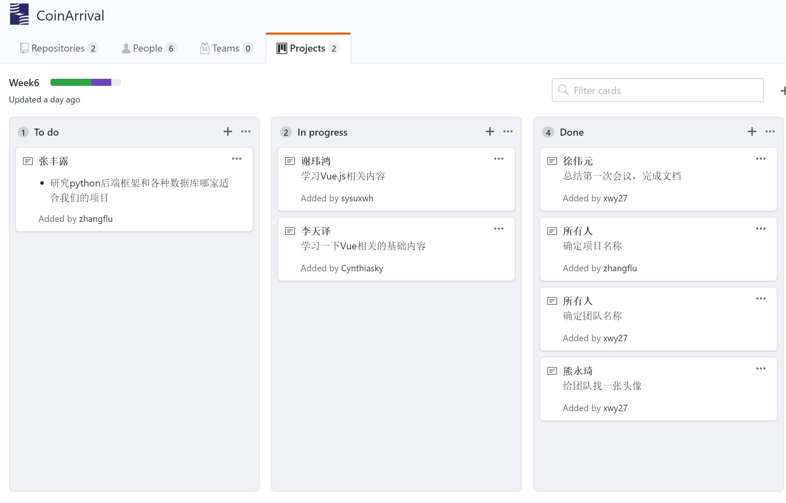
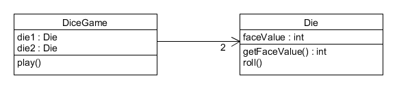

### 1、简答题

#### 用简短的语言给出对分析、设计的理解。  
分析强调的是对问题和需求的调查研究，而不是解决方案；而设计强调一个可以满足需求的概念性解决方法（包括软件、硬件），而不是具体实现。分析可以说是做正确的事，设计则是正确地做事。  

#### 用一句话描述面向对象的分析与设计的优势。  
面向对象分析与设计可以使真实世界领域中的概念和想象可视化，而不是对软件对象的描述。

#### 简述 UML（统一建模语言）的作用。考试考哪些图？  
UML（统一建模语言）是描述、构造和文档化系统制品的可视化语言。它是图形化表示法的事实标准，用来绘制和展示与软件相关的图形（以及文字）。  

图形化的表示机制分4类：
 
- 用例图：用户角度：功能、执行者
- 静态图：系统静态结构
 - 类图：概念及关系
 - 对象图：某种状态或时间段内，系统中活跃的对象及其关系
 - 包图：描述系统的分解结构
- 行为图：系统的动态行为
    - 交互图：描述对象间的消息传递
        - 顺序图：强调对象间消息发送的时序
        - 合作图：强调对象间的动态协作关系
    - 状态图：对象的动态行为。状态-事件-状态迁移-响应动作
    - 活动图：描述系统为完成某功能而执行的操作序列实
- 现图：描述系统的组成和分布状况
    - 构件图：组成部件及其关系
    - 部署图：物理体系结构及与软件单元的对应关系

#### 从软件本质的角度，解释软件范围（需求）控制的可行性
由于软件本身的复杂性、不可见性、不一致性、可变性，软件范围多数情况下对于客户和开发者都是模糊的，这形成软件产品与其他产品不同的开发过程。范围，在多数情况下，客户与开发者能就项目的 20% 内容给出严格的需求约定，80% 的内容都是相对模糊的。因此，围绕客户目标，发现并满足客户感兴趣的内容是最关键的。项目是综合性的任务，2/8法则会在许多地方用上，如需求获取，软件测试等方面。掌握 20% 软件工程基础知识有助于提升 80% 项目的效率和质量。

### 2、项目管理实践

- 看板使用练习（提交看板执行结果贴图，建议使用 Git project）
 - 使用截图工具（png格式输出），展现你团队的任务 Kanban
 - 每个人的任务是明确的。必须一周后可以看到具体结果
 - 每个人的任务是1-2项
 - 至少包含一个团队活动任务

Kanban展示  

- UML绘图工具练习（提交贴图，必须使用 UMLet）
 - 请在 参考书2 或 教材 中选择一个类图（给出参考书页码图号）  

参考书：UML和模式应用（中文） P9 图1-6（下图）  
