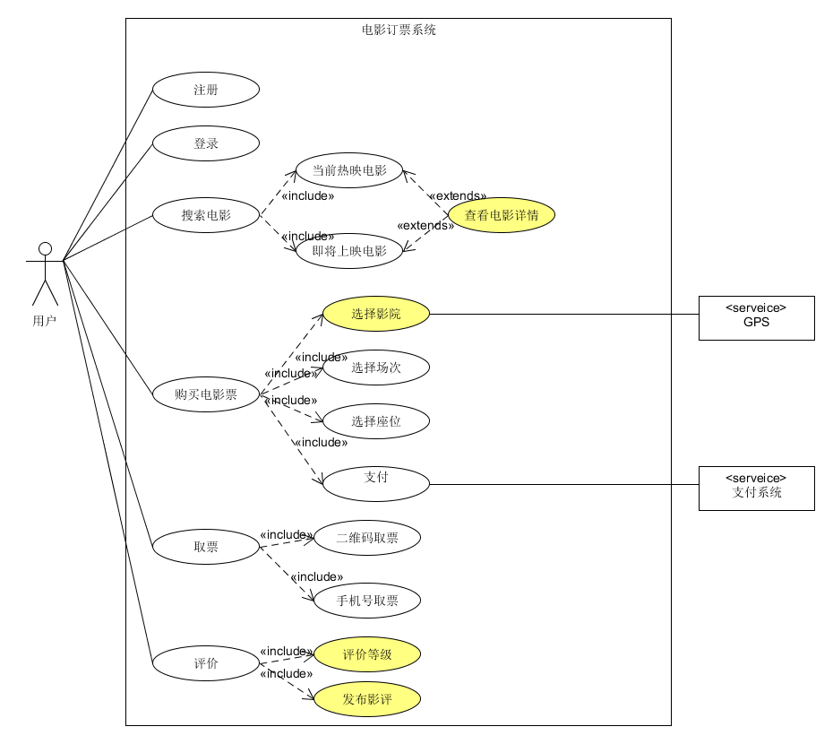
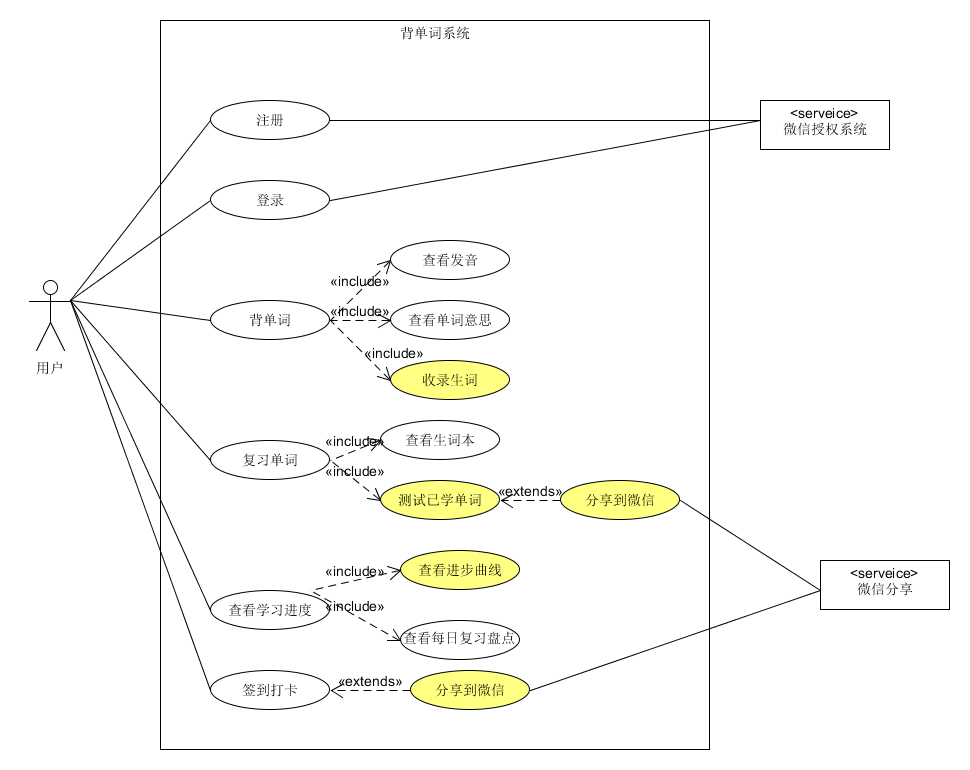

## 1、简答题

1. 用例的概念  
   用例是文本形式的情节描述，用以说明某参与者使用系统以实现某些目标。广泛应用于需求的发现和记录工作中。

2. 用例和场景的关系？什么是主场景或 happy path？  
   **场景(scenario)** 是参与者和系统之间的一系列特定的活动和交互，也称为用例实例(use case instance)。场景是使用系统的一个特定情节或用例的一条执行路径，例如使用现金成功购买商品的场景。  

   通俗来讲，**用例(use case)** 就是一组相关的成功和失败**场景集合**，用来描述参与者如何使用系统来实现其目标。  
   
   主场景是一个典型的、无条件的、理想方式的成功场景。它描述了满足涉众关注点的典型成功路径，通常不包括任何条件或分支。

3. 用例有哪些形式？  
   用例能够以不同形式化程度和格式进行编写：
   - **摘要** 简洁的一段式概要，通常用于主成功场景。一般用于早期需求分析过程中，为快速了解主题和范围。  
   - **非正式** 非正式的段落形式。用几个段落覆盖不同场景。使用场景同上。
   - **详述** 详细编写所有步骤及各种变化，同时具有补充部分，如前置条件和成功保证。当确定并以摘要形式编写大量用例后，详细地编写其中少量具有重要架构意义和高价值的用例。
4. 对于复杂业务，为什么编制完整用例非常难？  
   由于复杂业务涉及到的场景、参与者很多，很难将所有的场景有序、分类整理出来，并且很难保证用例的完整性。
5. 什么是用例图？  
   用例图是指由参与者、用例、边界以及它们之间的关系构成的用于描述系统功能的视图。 用例图是外部用户（被称为参与者）所能观察到的系统功能的模型图。  

6. 用例图的基本符号与元素？  
- 参与者：指在使用系统或与系统交互中所扮演的角色；用一个**小人**表示。
- 用例：指某参与者使用系统以实现的某些目标；用一个**椭圆**表示。
- 子系统：用于展示一个系统的部分功能；用一个**矩形框**表示。
- 关系
  - 关联：表示参与者与用例之间的通信，任何一方都可发送或接受消息; 用**箭头**表示，箭头指向消息接收方。
  - 泛化：就是通常理解的继承关系，子用例继承了父用例的所有结构、行为和关系，同时表现出更特别的行为； 用**箭头**表示，箭头由子用例指向父用例。
  - 包含：包含关系用来把一个较复杂用例所表示的功能分解成较小的步骤；用**箭头**表示，箭头由复杂用例指向分解后的用例。
  - 扩展：指用例功能的延伸，相当于为基础用例提供一个附加功能；用**箭头**表示，箭头由扩展用例指向基础用例。
  
7. 用例图的画法与步骤
 - 寻找参与者
   - 所谓的参与者是指所有存在于系统外部并与系统进行交互的人或其他系统。
   - 通过系统边界决定参与者。
   - 有时候我们需要在系统内部定时地执行一些操作，对于这种情况，我们可以抽象出一个系统时钟或定时器参与者，利用该参与者来触发这一类定时操作。
 - 确定用例
   - 根据参与者来确定系统的用例，主要是看各参与者需要系统提供什么样的服务，或者说参与者是如何使用系统的。
 - 确定参与者和用例之间的关系
   - 使用"关联"、"包括"、"扩展"和"泛化"关系将参与者和用例、用例和用例之间联系起来。

8. 用例图给利益相关人与开发者的价值有哪些？
- 简洁、直观、规范、易理解。用例图包含的元素很简单，并且不依赖开发语言，无论是对于利益相关人还是开发者来说都是易理解的。
- 用户导向、描述精准。用例方法完全是站在用户的角度上（从系统的外部）来描述系统的功能的。我们不管系统内部实现功能的机制，仅仅把系统看作一个黑盒，然后参与者与其进行交互，也就是用例是基于用户场景的，所以能更精准地表达用户功能需求。
- 需求与设计分离。因为用例图是站在系统外的视角描述系统需求的，所以并没有介入到系统内部实现细节，这就让需求和设计工作分离开来，条理清晰。
- 便于设计测试用例。用例图描述的就是一个用户场景，测试设计人员正好可以根据用例图设计测试用例。
- 边界清晰。一个矩形框把系统边界清晰、明确地表达出来，便于设计人员据此把握系统范围。
- 敏捷。用例图允许我们讲故事、写卡片，允许我们比较敏捷地实现功能需求方面的管理与交流。

---

2、建模练习题（用例模型）

选择2-3个你熟悉的类似业务的在线服务系统（或移动 APP），如定旅馆（携程、去哪儿等）、定电影票、背单词APP等，分别绘制它们用例图。并满足以下要求：
  - 请使用用户的视角，描述用户目标或系统提供的服务
  - 粒度达到子用例级别，并用 include 和 exclude 关联它们
  - 请用色彩标注出你认为创新（区别于竞争对手的）用例或子用例
  - 尽可能识别外部系统和服务
  
电影订票系统  

背单词系统

然后，回答下列问题：
- 为什么相似系统的用例图是相似的？  
  从参与者的角度来说，参与者希望系统提供的服务应该是相似的。如买火车票，参与者都有查看火车行程表、选择车次、进行购票的需求，使得详细系统都会包含许多相似的用例。
- 如果是定旅馆业务，请对比 Asg_RH 用例图，简述如何利用不同时代、不同地区产品的用例图，展现、突出创新业务和技术  
  可以根据用户的历史消费记录引入用户推荐系统，或者根据不同地方的旅馆选择提供多种智能解决方案等措施，完善用户体验，提升用户的粘合度。
- 如何利用用例图定位创新思路（业务创新、或技术创新、或商业模式创新）在系统中的作用  
  在主场景上尽可能地引用创新技术，让更多地客户在一般的软件使用过程中能够直观地感受到软件的创新，吸引更多用户的眼球，为商业发展奠定一定的基础。
- 请使用 SCRUM 方法，选择一个用例图，编制某定旅馆开发的需求（backlog）开发计划表  

  ID | Name | Imp | Est(man-day) | How to demo
  ---|---|---|---|---
  1 | 注册&登录 | 5 | 2 | 输入手机号、密码，获取验证码，验证通过后注册完成，登录时使用已注册的手机号和密码登录
  2 | 查询酒店信息 | 7 | 4 | 通过GPS定位，获取周围的酒店信息，选择入住时间段、价格区间后返回相应的酒店信息
  3 | 预约酒店 | 10 | 4 | 在查询到的酒店中选择房型，确认订单并支付，支付成功后收到成功预约通知
  4 | 评价系统 | 6 | 3 | 在入住结束后可以填写评价，评价内容会展示在酒店详细信息中

- 根据任务4，参考 使用用例点估算软件成本，给出项目用例点的估算  

  用例 | 事务 | 计算 | 原因 | UC权重
  ---|---|---|---|---
  注册&登录 | 2 | 2 | 登录方式简单方便 | 简单
  查询酒店信息 | 8 | 6 | 酒店信息多，筛选条件复杂，可能还需要考虑个性化推荐 | 复杂
  预约酒店 | 6 | 6 | 可能要处理高并发的订单 | 平均
  评价系统 | 6 | 4 | 评价系统需要进行筛选、排序 | 平均
